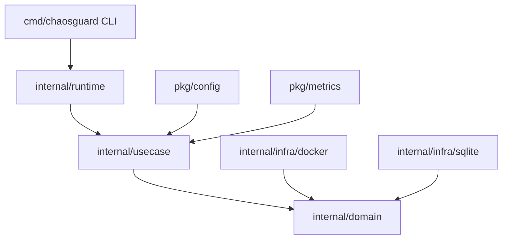

# ChaosGuard

**ChaosGuard** is a production-grade, automated Chaos Engineering platform for Docker container environments. It automatically inspects, tests, and validates service resilience under different failure scenarios (pausing, stopping, restarting, or killing containers) and exposes structured Prometheus metrics alongside a local REST API.

---

## 1. Architectural Blueprint

The platform adheres to **Clean Architecture** and **Domain-Driven Design (DDD)** practices:



### Components and Separation
*   **Domain Layer** (`internal/domain`): Exposes core database representations and runtime control interfaces like `Attack` and `ContainerController`.
*   **Usecase Layer** (`internal/usecase`): Holds business logic orchestrators like the `attack.Manager`, `recovery.Manager`, and automated `scheduler.Scheduler`.
*   **Infrastructure Layer** (`internal/infra`): Plugs in low-level details like official Docker SDK APIs and SQLite persistence.
*   **API Layer** (`internal/api`): Implements a Gin engine, middlewares (CORS, Request ID, Logging, Panic Recovery), and REST endpoints.
*   **Composition Root** (`internal/runtime`): Boots system dependencies and manages graceful shutdown orchestration.

---

## 2. Prerequisites
1.  **Go SDK**: `1.25+`
2.  **Docker Daemon**: Must be running locally and accessible via standard Docker sockets.

---

## 3. Getting Started

### Installation
Clone the repository and build the binary:
```bash
go build -o chaosguard ./cmd/chaosguard
```

### Setup Configuration
Initialize the default system configuration file (`chaosguard.yaml`):
```bash
./chaosguard init
```

### Environment Check
Run doctor diagnostic validation to verify local Docker access, port states, and database write access:
```bash
./chaosguard doctor
```

---

## 4. CLI Guide

*   **Start Daemon**: Runs the metrics agent, background scheduler, and REST API:
    ```bash
    ./chaosguard start --verbose
    ```
*   **Stop Daemon**: Remotely stops the running daemon and restores affected containers:
    ```bash
    ./chaosguard stop
    ```
*   **Query Status**: Inspects the real-time health, active attacks, and container metrics:
    ```bash
    ./chaosguard status
    ```
*   **Inject Chaos Failure**: Immediately triggers an ad-hoc failure on a container:
    ```bash
    ./chaosguard attack --target <container-name-or-id> --type pause --duration 15
    ```
*   **Export Report**: Saves resilience and experiment logs into JSON, CSV, or HTML:
    ```bash
    ./chaosguard report --format html --output ./report.html
    ```
*   **Launch Dashboard**: Opens the default browser to view interactive API documentation:
    ```bash
    ./chaosguard dashboard --open
    ```

---

## 5. REST API & Swagger Documentation

The API runs on the configured dashboard port (default `8080`):
*   **Interactive Documentation**: Access the full Swagger UI at `http://localhost:8080/swagger/index.html`.
*   **Prometheus Metrics**: Exposes metrics at `/metrics` (reusing the registry port `2112` or port `8080`).

---

## 6. Roadmap
*   **v0.1.x**: SQLite persistence, CLI engine, and Docker SDK integrations. (Completed)
*   **v0.2.x**: Gin REST API integration, Swagger OpenAPI specs, and client-server CLI wiring. (Completed)
*   **v0.3.x**: React + TypeScript local web dashboard implementation. (Milestone 0.3.0)
